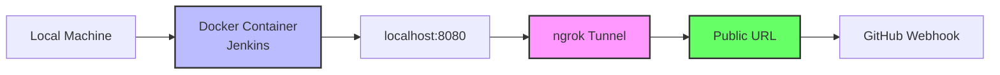
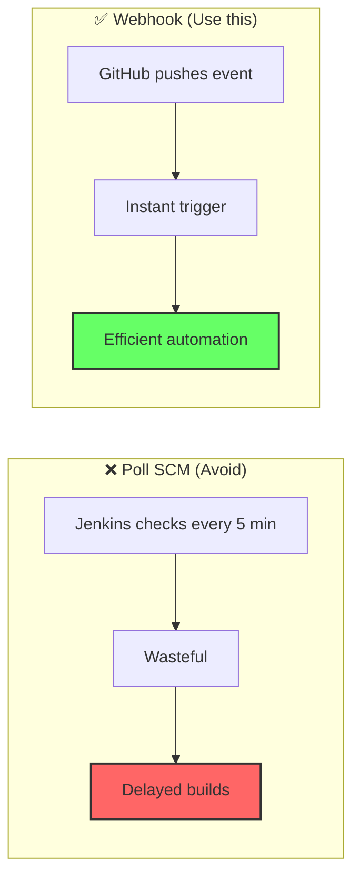
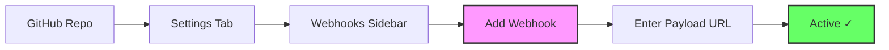
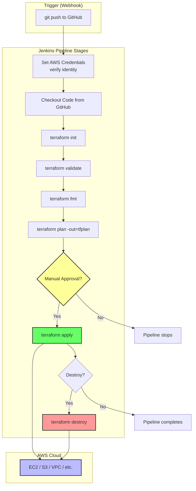
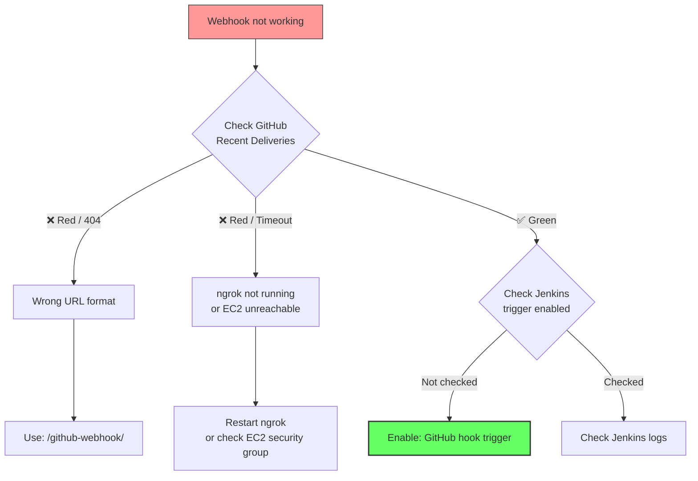
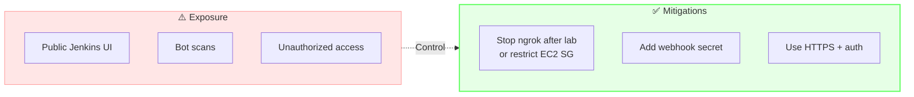
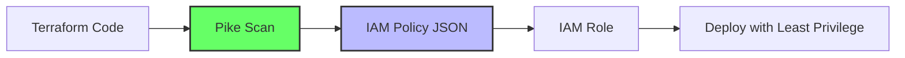
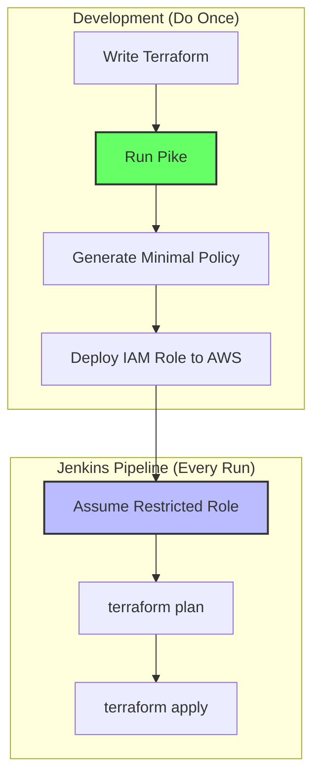

# Jenkins + Ngrok Lab Runbook

## Jenkins Deployment (Docker or AWS EC2) → GitHub Webhooks → Terraform AWS Deployment

### Optional: Deploy Jenkins Directly on AWS EC2 (Easier Alternative)

---

## Lab Overview



This is event-driven automation: GitHub pushes → webhook hits Jenkins → pipeline runs → Terraform deploys to AWS.

---

## Two Deployment Options

| Option | Description | Best For |
|--------|-------------|---------|
| **Option A: Local Docker (Orbstack)** | Run Jenkins locally with ngrok tunnel | Development, testing, local labs |
| **Option B: AWS EC2 (Easier)** | Deploy Jenkins directly on EC2 with public IP | No ngrok needed, always accessible |

> [!TIP]
> **Option B (EC2) is easier** because Jenkins gets a public IP address immediately. No ngrok tunnel required. Skip to Part 1B if you want to use EC2.

---

## Prerequisites

Before starting, ensure you have:

| Prerequisite | Verification |
|--------------|--------------|
| Docker/Orbstack installed (Option A) | `docker --version` |
| AWS account (Option B) | Access to EC2 |
| GitHub account | <https://github.com> |
| GitHub repository | Create one or use existing |
| AWS account (for deployment) | IAM user with programmatic access |

---

## Quick Commands Reference (Docker)

```bash
# Check running containers
docker ps

# Exec into container (as root)
docker exec -it --user root devsecops-sandbox bash

# Install packages inside container (if needed)
apt update && apt upgrade -y
```

---

# Part 1A: GitHub Repository Setup (FIRST - Prerequisite)

*Applies to both Option A and Option B*

### 1A.1 Create or Verify GitHub Repository

You need a GitHub repository to host your code and receive webhooks.

1. Go to <https://github.com>
2. Create a new repository or use an existing one
3. Note the repository URL: `https://github.com/yourusername/your-repo.git`

### 1A.2 Add Initial Files to Repository

```bash
# Clone your repository (if new)
git clone https://github.com/yourusername/your-repo.git
cd your-repo

# Create a README
echo "# My DevSecOps Project" > README.md

# Create a basic Terraform file (for testing)
cat > main.tf << 'EOF'
terraform {
  required_providers {
    aws = {
      source  = "hashicorp/aws"
      version = "~> 5.0"
    }
  }
}

provider "aws" {
  region = "us-west-2"
}

# Simple S3 bucket example
resource "aws_s3_bucket" "test_bucket" {
  bucket = "jenkins-test-bucket-${formatdate("YYYYMMDDhhmmss", timestamp())}"
}
EOF

# Push to GitHub
git add .
git commit -m "Initial commit"
git push
```

> [!IMPORTANT]
> GitHub repository must exist BEFORE configuring Jenkins, as Jenkins will reference it for source code management.

---

# Option A: Local Jenkins (Docker + Orbstack)

## Part 2A: Create New Jenkins Container from Scratch

### 2A.1 Clean Up Old Resources

```bash
# Stop and remove the old container
docker stop devsecops-sandbox 2>/dev/null
docker rm devsecops-sandbox 2>/dev/null

# Remove the old volume (WARNING: this deletes ALL Jenkins data)
docker volume rm 3d6ba0b9febf0c2033346e3cc25b40a0106886 2>/dev/null

# Verify nothing is left
docker ps -a | grep jenkins
docker volume ls | grep jenkins
```

> [!CAUTION]
> Removing the volume deletes all Jenkins jobs, credentials, and configurations. This is a **complete fresh start**.

### 2A.2 Create New Named Volume

```bash
# Create a clean volume with a readable name
docker volume create jenkins_home

# Verify
docker volume ls
```

### 2A.3 Run New Jenkins Container

```bash
docker run -d \
  --name devsecops-sandbox \
  -p 8080:8080 \
  -p 50000:50000 \
  -v jenkins_home:/var/jenkins_home \
  jenkins/jenkins:lts
```

**Flag Reference:**

| Flag | Purpose |
|------|---------|
| `-d` | Run in background (detached) |
| `--name devsecops-sandbox` | Name the container |
| `-p 8080:8080` | Map host port 8080 → container port 8080 (Jenkins UI) |
| `-p 50000:50000` | Map host port 50000 → container port 50000 (Jenkins agents) |
| `-v jenkins_home:/var/jenkins_home` | Mount named volume for persistent data |
| `jenkins/jenkins:lts` | Official Jenkins LTS image |

### 2A.4 Verify Container is Running

```bash
docker ps
```

Expected output:

```text
CONTAINER ID   IMAGE                 COMMAND                  STATUS         PORTS
abc123def456   jenkins/jenkins:lts   "/usr/bin/tini -- /u…"   Up 10 seconds   0.0.0.0:8080->8080/tcp, 0.0.0.0:50000->50000/tcp
```

### 2A.5 Get Initial Admin Password

```bash
docker exec devsecops-sandbox cat /var/jenkins_home/secrets/initialAdminPassword
```

Copy the password (looks like: `a1b2c3d4e5f6g7h8i9j0`).

### 2A.6 Access Jenkins UI

1. Open browser to: **<http://localhost:8080>**
2. Enter the initial admin password
3. Follow setup wizard:
   - **Install suggested plugins** (recommended for first run)
   - Create admin user (or continue as admin with initial password)
   - Set Jenkins URL (keep `http://localhost:8080`)

---

# Option B: AWS EC2 Jenkins Deployment (Easier - No ngrok)

## Part 1B: Launch EC2 Instance for Jenkins

### 1B.1 Launch EC2 Instance

1. Log into AWS Console → EC2 → Launch Instance
2. Configure:

| Setting | Value |
|---------|-------|
| **Name** | `jenkins-server` |
| **AMI** | Ubuntu 22.04 LTS (or Amazon Linux 2023) |
| **Instance type** | `t2.medium` (minimum for Jenkins) or `t3.medium` |
| **Key pair** | Create or select existing (save .pem file) |
| **Network settings** | Allow HTTP (port 80) and Jenkins (port 8080) |
| **Storage** | 20 GB gp3 minimum |

### 1B.2 Configure Security Group (CRITICAL)

Add these inbound rules:

| Type | Port | Source | Purpose |
|------|------|--------|---------|
| **HTTP** | 80 | 0.0.0.0/0 | (Optional) Reverse proxy |
| **Custom TCP** | 8080 | 0.0.0.0/0 | **Jenkins Web UI** |
| **SSH** | 22 | Your IP | Remote access |

> [!IMPORTANT]
> Port 8080 must be open to access Jenkins. In production, restrict this to specific IPs.

### 1B.3 Connect to EC2 Instance

```bash
# Make key pair private
chmod 400 your-key.pem

# Connect via SSH
ssh -i your-key.pem ubuntu@<your-ec2-public-ip>
# For Amazon Linux: ssh -i your-key.pem ec2-user@<your-ec2-public-ip>
```

### 1B.4 Install Jenkins on EC2

#### Ubuntu/Debian:

```bash
# Update system
sudo apt update
sudo apt upgrade -y

# Install Java (Jenkins requirement)
sudo apt install openjdk-17-jdk -y

# Add Jenkins repository
sudo wget -O /usr/share/keyrings/jenkins-keyring.asc \
  https://pkg.jenkins.io/debian-stable/jenkins.io-2023.key
echo "deb [signed-by=/usr/share/keyrings/jenkins-keyring.asc]" \
  https://pkg.jenkins.io/debian-stable binary/ | sudo tee \
  /etc/apt/sources.list.d/jenkins.list > /dev/null

# Install Jenkins
sudo apt update
sudo apt install jenkins -y

# Start Jenkins
sudo systemctl start jenkins
sudo systemctl enable jenkins

# Check status
sudo systemctl status jenkins
```

#### Amazon Linux 2023:

```bash
# Update system
sudo dnf update -y

# Install Java
sudo dnf install java-17-amazon-corretto -y

# Add Jenkins repository
sudo wget -O /etc/yum.repos.d/jenkins.repo \
  https://pkg.jenkins.io/redhat-stable/jenkins.repo
sudo rpm --import https://pkg.jenkins.io/redhat-stable/jenkins.io-2023.key

# Install Jenkins
sudo dnf install jenkins -y

# Start Jenkins
sudo systemctl start jenkins
sudo systemctl enable jenkins
```

### 1B.5 Get Initial Admin Password

```bash
# View initial admin password
sudo cat /var/lib/jenkins/secrets/initialAdminPassword
```

### 1B.6 Access Jenkins UI on EC2

**Jenkins URL:** `http://<your-ec2-public-ip>:8080`

> [!NOTE]
> Append `:8080` to the EC2 public IP address to access Jenkins.
>
> Example: `http://54.123.45.67:8080`

1. Open browser and go to: `http://<your-ec2-public-ip>:8080`
2. Enter the initial admin password from step 1B.5
3. Follow setup wizard:
   - **Install suggested plugins**
   - Create admin user
   - Set Jenkins URL (use `http://<your-ec2-public-ip>:8080`)

### 1B.7 Install Terraform on EC2

```bash
# SSH into EC2
ssh -i your-key.pem ubuntu@<your-ec2-public-ip>

# Install Terraform
sudo apt update
sudo apt install -y wget unzip

# Download Terraform
wget https://releases.hashicorp.com/terraform/1.8.5/terraform_1.8.5_linux_amd64.zip
unzip terraform_1.8.5_linux_amd64.zip
sudo mv terraform /usr/local/bin/

# Verify
terraform version
```

### 1B.8 No Ngrok Needed for EC2

> [!TIP]
> **EC2 has a public IP address. You don't need ngrok.** GitHub webhook will point directly to `http://<your-ec2-public-ip>:8080/github-webhook/`

**Your webhook URL becomes:**

```text
http://<your-ec2-public-ip>:8080/github-webhook/
```

> [!WARNING]
> EC2 uses HTTP, not HTTPS. For production, add an SSL certificate and configure HTTPS.

---

# Part 3: Jenkins Job Configuration (Both Options)

*This section applies to both Option A (Docker) and Option B (EC2)*

## 3.1 Install Required Plugins

After initial setup, install the necessary plugins for GitHub integration and AWS deployment.

### Step 1: Navigate to Plugin Manager

From Jenkins dashboard:
- Click **Manage Jenkins** (left sidebar)
- Click **Plugins**
- Click **Available plugins** tab

### Step 2: Install Required Plugins

Search for and check the following plugins:

| Plugin | Purpose | Search Term |
|--------|---------|-------------|
| **GitHub Integration** | Webhook handling | `github` |
| **Pipeline: GitHub** | Pipeline integration | `pipeline github` |
| **AWS Credentials** | IAM authentication | `aws credentials` |
| **Git plugin** | SCM integration | `git` (usually pre-installed) |
| **Terraform plugin** | Terraform integration (optional) | `terraform` |

### Step 3: Install Plugins

After checking the boxes:
- Click **Install without restart** (or **Download now and install after restart**)

> [!TIP]
> Wait for all plugins to install before proceeding. You'll see success messages when complete.

### Step 4: Verify Installation

Go to **Manage Jenkins** → **Plugins** → **Installed plugins** to confirm each plugin is listed.

## 3.2 Install Terraform in Jenkins (Docker Option Only)

*For Option A (Docker):*

```bash
# Exec into container as root
docker exec -it --user root devsecops-sandbox bash

# Update package lists and install dependencies
apt update
apt install -y wget unzip

# Download Terraform
wget https://releases.hashicorp.com/terraform/1.8.5/terraform_1.8.5_linux_amd64.zip

# Extract and install
unzip terraform_1.8.5_linux_amd64.zip
mv terraform /usr/local/bin/

# Verify installation
terraform version

# Exit container
exit
```

*For Option B (EC2):* Terraform was already installed in Part 1B.7.

## 3.3 Create Pipeline Job

1. From Jenkins dashboard, click **New Item**
2. Enter name: `devsecops-pipeline`
3. Select **Pipeline** and click **OK**

## 3.4 Configure Source Code Management

Scroll to **Pipeline** section:

| Field | Value |
|-------|-------|
| **Definition** | Pipeline script from SCM |
| **SCM** | Git |
| **Repository URL** | `https://github.com/yourusername/your-repo.git` |
| **Credentials** | (Add GitHub credentials if private repo) |
| **Branches to build** | `*/main` |
| **Script Path** | `Jenkinsfile` |

## 3.5 Configure Build Triggers (CRITICAL)



Scroll to **Build Triggers** and check:

```text
✅ GitHub hook trigger for GITScm polling
```

**Do NOT enable:**

```text
⛔ Poll SCM
```

## 3.6 Add AWS Credentials in Jenkins

1. **Manage Jenkins** → **Manage Credentials** → **Global** → **Add Credentials**
2. Choose **AWS Credentials** (from AWS Credentials plugin)
3. Fill:
   - **Access Key ID:** (from IAM user)
   - **Secret Access Key:** (from IAM user)
   - **ID:** `AWS-Pipeline`
   - **Description:** `AWS credentials for Terraform deployment`
4. Click **Create**

## 3.7 Save Job Configuration

Click **Save** at the bottom of the page.

---

# Part 4: The Jenkinsfile

## 4.1 Create Jenkinsfile in Your Repository

Create a file named `Jenkinsfile` in your repository root:

```groovy
// ============================================================================
// JENKINSFILE - DevSecOps Pipeline
// ============================================================================
// Deploys AWS infrastructure via Terraform. Triggered by GitHub webhook pushes.
// ============================================================================

pipeline {
    agent any  // Runs on any Jenkins agent (local Docker or EC2)
   
    environment {
        AWS_REGION = 'us-west-2'
    }
    
    stages {
        
        // --------------------------------------------------------------------
        // STAGE: Set AWS Credentials
        // --------------------------------------------------------------------
        // Fails fast by verifying credentials before any real work.
        // withCredentials injects AWS keys from Jenkins credential 'AWS-Pipeline'.
        // --------------------------------------------------------------------
        stage('Set AWS Credentials') {
            steps {
                withCredentials([[
                    $class: 'AmazonWebServicesCredentialsBinding',
                    credentialsId: 'AWS-Pipeline'
                ]]) {
                    sh '''
                    aws sts get-caller-identity  # Returns Account ID, User ARN
                    '''
                }
            }
        }
        
        // --------------------------------------------------------------------
        // STAGE: Checkout Code
        // --------------------------------------------------------------------
        // Pulls latest code from GitHub. The webhook trigger ensures this runs
        // immediately after each push to main.
        // --------------------------------------------------------------------
        stage('Checkout Code') {
            steps {
                git branch: 'main', 
                    url: 'https://github.com/KirkAlton-Class7/jenkins-gcheck' 
            }
        }

        // ====================================================================
        // JFROG ARTIFACTORY STAGE (Commented - Keep for Reference)
        // ====================================================================
        // Artifactory is a universal artifact repository for binaries, Docker
        // images, and dependencies. Uncomment this when you need to store
        // compiled code, scan for vulnerabilities, or promote the same artifact
        // across environments (dev → test → prod) without rebuilding.
        //
        // To enable: install JFrog CLI in the Jenkins container, add a Jenkins
        // credential named 'jfrog-creds', then uncomment the stage below.
        // ====================================================================
        // stage('Testing') {
        //     steps {
        //         withCredentials([string(credentialsId: 'jfrog-creds', variable: 'JFROG_TOKEN')]) {
        //             jf '-v'
        //             jf 'rt ping'
        //             sh 'touch test-file'
        //             sh 'jf rt upload test-file tf-terraform/ --url=https://your-artifactory.jfrog.io --user=your-username --password=$JFROG_TOKEN'
        //             jf 'rt bp'
        //         }
        //     } 
        // }

        // --------------------------------------------------------------------
        // STAGE: Initialize Terraform
        // --------------------------------------------------------------------
        // Always the first Terraform command. Downloads providers and sets up
        // backend storage. AWS credentials are exported because Terraform reads
        // them directly from environment variables.
        // --------------------------------------------------------------------
        stage('Initialize Terraform') {
            steps {
                withCredentials([[
                    $class: 'AmazonWebServicesCredentialsBinding',
                    credentialsId: 'AWS-Pipeline'
                ]]) {
                    sh '''
                    export AWS_ACCESS_KEY_ID=$AWS_ACCESS_KEY_ID
                    export AWS_SECRET_ACCESS_KEY=$AWS_SECRET_ACCESS_KEY
                    terraform init
                    '''
                }
            }
        }

        // --------------------------------------------------------------------
        // STAGE: Validate Terraform
        // --------------------------------------------------------------------
        // Quick syntax check. No credentials needed because this only validates
        // HCL structure, not provider configuration or resource existence.
        // --------------------------------------------------------------------
        stage('Validate') {
            steps {
                sh 'terraform validate'
            }
        }

        // --------------------------------------------------------------------
        // STAGE: Format Terraform
        // --------------------------------------------------------------------
        // Enforces consistent code style across the team. Automatically fixes
        // formatting issues. No credentials required.
        // --------------------------------------------------------------------
        stage('Format Terraform') {
            steps {
                sh 'terraform fmt'
            }
        }

        // --------------------------------------------------------------------
        // STAGE: Plan Terraform
        // --------------------------------------------------------------------
        // Previews what Terraform will change and saves the plan to tfplan.
        // This file ensures the apply stage uses exactly what was reviewed,
        // preventing drift between planning and execution.
        // --------------------------------------------------------------------
        stage('Plan Terraform') {
            steps {
                withCredentials([[
                    $class: 'AmazonWebServicesCredentialsBinding',
                    credentialsId: 'AWS-Pipeline'
                ]]) {
                    sh '''
                    export AWS_ACCESS_KEY_ID=$AWS_ACCESS_KEY_ID
                    export AWS_SECRET_ACCESS_KEY=$AWS_SECRET_ACCESS_KEY
                    terraform plan -out=tfplan
                    '''
                }
            }
        }

        // --------------------------------------------------------------------
        // STAGE: Apply Terraform (MANUAL APPROVAL)
        // --------------------------------------------------------------------
        // The input() step creates a manual approval gate. The pipeline pauses
        // until a user clicks "Deploy" in the Jenkins UI. Combined with the
        // saved tfplan and -auto-approve flag, this gives safe, repeatable
        // automation without interactive prompts.
        // --------------------------------------------------------------------
        stage('Apply Terraform') {
            steps {
                input message: "Approve Terraform Apply?", ok: "Deploy"
                withCredentials([[
                    $class: 'AmazonWebServicesCredentialsBinding',
                    credentialsId: 'AWS-Pipeline'
                ]]) {
                    sh '''
                    export AWS_ACCESS_KEY_ID=$AWS_ACCESS_KEY_ID
                    export AWS_SECRET_ACCESS_KEY=$AWS_SECRET_ACCESS_KEY
                    terraform apply -auto-approve tfplan
                    '''
                }
            }
        }

        // --------------------------------------------------------------------
        // STAGE: Optional Destroy (MANUAL CHOICE)
        // --------------------------------------------------------------------
        // After a successful apply, the pipeline asks whether to destroy
        // resources. Select 'yes' for labs to avoid AWS charges. Never
        // auto-destroy production resources.
        // --------------------------------------------------------------------
        stage('Optional Destroy') {
            steps {
                script {
                    def destroyChoice = input(
                        message: 'Do you want to run terraform destroy?',
                        ok: 'Submit',
                        parameters: [
                            choice(
                                name: 'DESTROY',
                                choices: ['no', 'yes'],
                                description: 'Select yes to destroy resources'
                            )
                        ]
                    )

                    if (destroyChoice == 'yes') {
                        withCredentials([[
                            $class: 'AmazonWebServicesCredentialsBinding',
                            credentialsId: 'AWS-Pipeline'
                        ]]) {
                            sh 'terraform destroy -auto-approve'
                        }
                    } else {
                        echo "Skipping destroy"
                    }
                }
            }
        }
    }

    // --------------------------------------------------------------------
    // POST: Run after all stages
    // --------------------------------------------------------------------
    // Executes regardless of success or failure. Ideal for notifications,
    // cleanup, or archiving.
    // --------------------------------------------------------------------
    post {
        success {
            echo '✅ Terraform deployment completed!'
        }
        failure {
            echo '❌ Terraform deployment failed!'
        }
    }
}
```

## 4.2 Commit and Push

```bash
git add Jenkinsfile
git commit -m "Add Jenkins pipeline with Terraform"
git push
```

---

# Part 5: Webhook Configuration (Option-Specific)

## Option A: Local Docker (ngrok Required)

### 5A.1 Install Ngrok

Choose the installation method that matches your operating system:

**Homebrew (macOS):**

```bash
brew install ngrok/ngrok/ngrok
```

**APT (Ubuntu/Debian):**

```bash
curl -s https://ngrok-agent.s3.amazonaws.com/ngrok.asc \
  | sudo tee /etc/apt/trusted.gpg.d/ngrok.asc >/dev/null
echo "deb https://ngrok-agent.s3.amazonaws.com buster main" \
  | sudo tee /etc/apt/sources.list.d/ngrok.list
sudo apt update
sudo apt install ngrok
```

**Fallback (Works Anywhere):**

```bash
wget https://bin.equinox.io/c/bNyj1mQVY4c/ngrok-v3-stable-linux-amd64.zip
unzip ngrok-v3-stable-linux-amd64.zip
sudo mv ngrok /usr/local/bin/
```

### 5A.2 Start Ngrok Tunnel

```bash
ngrok http 8080
```

You'll see output like:

```text
Web Interface                 http://127.0.0.1:4040
Forwarding                    https://joni-flooded-improbably.ngrok-free.dev -> http://localhost:8080
```

### 5A.3 Preview and Verify Ngrok Tunnel

1. **Open the ngrok URL in your browser:**

   ```text
   https://joni-flooded-improbably.ngrok-free.dev
   ```

2. **You should see the Jenkins login page.**

### 5A.4 Your Webhook URL (Docker)

```text
https://[your-ngrok].ngrok-free.dev/github-webhook/
```

### 5A.5 Keep Ngrok Running

| Method | Command |
|--------|---------|
| **Dedicated terminal** | `ngrok http 8080` (leave open) |
| **Background** | `ngrok http 8080 &` |
| **With tmux** | `tmux new -s ngrok` then run |

> [!WARNING]
> `Ctrl+C` kills the tunnel. GitHub webhooks will fail.

> [!TIP]
> If you restart ngrok, you'll get a new URL. Update it in GitHub webhook settings.

---

## Option B: AWS EC2 (No Ngrok Required)

### 5B.1 Your Jenkins URL

**Jenkins URL:** `http://<your-ec2-public-ip>:8080`

> [!TIP]
> EC2 has a public IP address. No ngrok needed!

### 5B.2 Your Webhook URL (EC2)

```text
http://<your-ec2-public-ip>:8080/github-webhook/
```

**Example:**

```text
http://54.123.45.67:8080/github-webhook/
```

### 5B.3 Verify Jenkins is Accessible

Open browser and go to: `http://<your-ec2-public-ip>:8080`

> [!IMPORTANT]
> Make sure port 8080 is open in the EC2 security group. If you can't access Jenkins, check:
> 1. Security group inbound rules
> 2. Jenkins is running: `sudo systemctl status jenkins`
> 3. Firewall: `sudo ufw status` (if using Ubuntu)

---

# Part 6: GitHub Webhook Configuration (Both Options)

Now configure GitHub to send events to Jenkins.

## 6.1 Navigate to Webhook Settings

1. Go to your GitHub repository
2. Click **Settings** (tab near the top)
3. Click **Webhooks** (left sidebar)
4. Click **Add webhook** (button)

## 6.2 Configure Webhook

Fill in the following fields:

| Field | Value |
|-------|-------|
| **Payload URL** | Your webhook URL from Part 5 |
| **Content type** | `application/json` |
| **Secret** | (Optional — leave blank for lab) |
| **SSL verification** | Enable (default) |

**Option A (Docker) example:**

```text
https://joni-flooded-improbably.ngrok-free.dev/github-webhook/
```

**Option B (EC2) example:**

```text
http://54.123.45.67:8080/github-webhook/
```

> [!IMPORTANT]
> The URL must end with `/github-webhook/`. This is the Jenkins endpoint that listens for webhooks.

## 6.3 Select Events

Choose **"Just the push event"** — this triggers the webhook only when code is pushed.

## 6.4 Activate Webhook

Ensure **Active** is checked, then click **Add webhook**.

## 6.5 Verify Webhook Configuration

After adding, you'll see your webhook in the list. GitHub will send a test ping. A green checkmark appears when GitHub successfully delivers.



---

# Part 7: Pipeline Execution Flow



---

# Part 8: Test the Full Pipeline

## 8.1 Trigger a Build

```bash
# Make a test change
echo "test pipeline" >> README.md
git add .
git commit -m "test webhook and pipeline"
git push
```

## 8.2 Verify Webhook Delivery

1. GitHub repo → **Settings** → **Webhooks** → **Recent Deliveries**
2. You should see a green checkmark ✅

## 8.3 Monitor Jenkins

1. Go to Jenkins dashboard
   - **Docker:** <http://localhost:8080>
   - **EC2:** `http://<your-ec2-public-ip>:8080`
2. Your job `devsecops-pipeline` should start automatically
3. Click on the build number to watch stages

## 8.4 Approve Deployment

When the pipeline reaches the **Apply Terraform** stage:
1. Jenkins will pause and show an input prompt
2. Click **Deploy** to approve
3. Watch Terraform create resources in AWS

## 8.5 Clean Up (Optional)

At the end of the pipeline, you'll be asked:

```text
Do you want to run terraform destroy?
```

- Select **yes** to tear down resources
- Select **no** to keep them

> [!CAUTION]
> Remember to destroy resources to avoid AWS charges.

---

# Part 9: Key Pipeline Patterns

| Pattern | Purpose | Example in Pipeline |
|---------|---------|---------------------|
| **Credentials Binding** | Inject AWS keys securely | `withCredentials([AmazonWebServicesCredentialsBinding])` |
| **Manual Approval Gate** | Human validation before deployment | `input message: "Approve Terraform Apply?"` |
| **Conditional Execution** | User choice for destroy | `if (destroyChoice == 'yes')` |
| **Post Actions** | Success/failure notifications | `post { success { ... } }` |
| **Environment Variables** | Region, paths | `environment { AWS_REGION = 'us-west-2' }` |

---

# Part 10: Troubleshooting

## Diagnosis Flow



## Common Issues

| Issue                         | Likely Cause                         | Fix                                       |
| ----------------------------- | ------------------------------------ | ----------------------------------------- |
| GitHub shows 404              | Wrong URL path                       | Add `/github-webhook/`                    |
| GitHub shows timeout          | ngrok not running or EC2 unreachable | Restart ngrok or check EC2 security group |
| Jenkins not triggering        | Trigger checkbox off                 | Enable in job config                      |
| Terraform not found           | Not installed                        | Install Terraform                         |
| AWS auth fails                | Wrong credentials                    | Verify IAM keys in Jenkins                |
| **EC2: Can't access Jenkins** | Port 8080 not open                   | Add inbound rule for port 8080            |
| **EC2: Jenkins not running**  | Service stopped                      | `sudo systemctl start jenkins`            |

## EC2-Specific Troubleshooting

```bash
# Check Jenkins status
sudo systemctl status jenkins

# View Jenkins logs
sudo journalctl -u jenkins -f

# Check if port 8080 is listening
sudo netstat -tlnp | grep 8080

# Check firewall (Ubuntu)
sudo ufw status
sudo ufw allow 8080

# Check security group from AWS Console
# Ensure inbound rule: TCP 8080 from 0.0.0.0/0
```

---

# Part 11: Security Considerations

## Risk Assessment



## Security Best Practices

| Level | Action |
|-------|--------|
| **Basic (Lab)** | Stop ngrok after testing; EC2: restrict security group to your IP |
| **Better** | Add GitHub webhook secret validation |
| **Stronger** | Use HTTPS (ngrok provides HTTPS; EC2 needs Let's Encrypt) |
| **Production** | Use API Gateway + ALB + IP allowlisting + TLS certificates |

## What Bots Will Try (Docker + ngrok)

Check ngrok dashboard at <http://127.0.0.1:4040> to see:
- `/wp-login.php` (WordPress exploits)
- `/admin`
- `/manager/html` (Tomcat)
- Random paths

This is normal for any public endpoint.

---

# Part 12: Optional - Harden IAM with Least Privilege Policies

*This section is optional. It shows how to generate minimal IAM permissions for your Terraform code. This is a key DevSecOps practice that limits blast radius if credentials are compromised.*

---

## What is Pike?

Pike scans your Terraform code and generates the **minimum IAM permissions** required to deploy it. Instead of using wildcard permissions (`"Action": "*"`) or overly permissive admin roles, Pike gives you a precise, locked-down policy.



---

## Why This Matters for DevSecOps

| Problem | Pike Solution |
|---------|---------------|
| Developers use `AdministratorAccess` | Generates scoped, minimal policies |
| Manual IAM policy writing is error-prone | Automated from actual Terraform resources |
| Over-permissive roles increase blast radius | Limits what Jenkins can do if compromised |
| Compliance requires least privilege | Documented, verifiable minimum permissions |

---

## Install Pike

### macOS (Homebrew)

```bash
brew tap jameswoolfenden/homebrew-tap
brew install jameswoolfenden/tap/pike
```

### Docker (No Installation required)

```bash
docker pull jameswoolfenden/pike
docker run --tty --volume $(pwd):/tf jameswoolfenden/pike scan -d /tf
```

### Windows (Scoop)

```bash
scoop bucket add iac https://github.com/JamesWoolfenden/scoop.git
scoop install pike
```

### Verify Installation

```bash
pike version
```

---

## Generate Your Least Privilege Policy

Navigate to your Terraform directory and run:

```bash
cd /path/to/your/terraform
pike scan -d .
```

**Example Output:**

```json
{
    "Version": "2012-10-17",
    "Statement": {
        "Effect": "Allow",
        "Action": [
            "ec2:DescribeInstances",
            "ec2:RunInstances",
            "ec2:CreateSecurityGroup",
            "s3:CreateBucket",
            "s3:PutBucketPolicy"
        ],
        "Resource": "*"
    }
}
```

### Output as Terraform (Ready to Deploy)

```bash
pike scan -o terraform -d .
```

Creates an `aws_iam_policy` resource you can add to your infrastructure.

### Save to File for Review

```bash
pike scan -w -d .
```

Creates `.pike/` folder with:
- `aws_iam_role.terraform_pike.tf`
- `pike.generated_policy.tf`

---

## How This Fits Your Pipeline

Pike is a **design-time tool**. Use it once to generate the policy, then:

1. Deploy the generated IAM role/policy to AWS
2. Update your Jenkins credentials to use that restricted role
3. Run your pipeline knowing Jenkins has only the permissions it actually needs



---

## Compare: Admin vs. Least Privilege

| Approach | IAM Policy | Risk |
|----------|------------|------|
| **Without Pike (Common in Labs)** | `{"Action": "*", "Resource": "*"}` | Jenkins compromise = full AWS account access |
| **With Pike** | `{"Action": ["ec2:DescribeInstances", "s3:CreateBucket"], "Resource": "arn:aws:..."}` | Limited to specific actions on specific resources |

---

## Quick Reference (Pike)

```bash
# Basic scan
pike scan -d .

# Generate Terraform policy
pike scan -o terraform -d .

# Write policy to .pike folder
pike scan -w -d .

# Create and deploy IAM role (AWS only)
pike make -d .

# Check deployed policy vs your Terraform
pike compare -d . -a arn:aws:iam::account:policy/your-policy

# Pull and scan a GitHub repo
pike pull -r https://github.com/your/repo -d .
```

---

## When to Use This

| Scenario | Recommendation |
|----------|----------------|
| **Class Lab** | Optional - good to know exists |
| **Personal Projects** | Recommended - builds good habits |
| **Production** | **Required** - least privilege is security baseline |

---

# Part 13: Lab Cleanup

## Option A: Docker Cleanup

```bash
# Stop ngrok (Ctrl+C in its terminal)

# Stop Jenkins container
docker stop devsecops-sandbox

# Remove container (optional)
docker rm devsecops-sandbox

# Remove volume (WARNING: deletes all data)
docker volume rm jenkins_home
```

## Option B: EC2 Cleanup

```bash
# Stop Jenkins service (optional)
sudo systemctl stop jenkins

# Terminate EC2 instance from AWS Console
# EC2 → Instances → Select instance → Instance state → Terminate
```

## Both Options: Remove Webhook

1. GitHub repo → **Settings** → **Webhooks**
2. Delete the webhook

---

# Quick Reference

## Option A: Docker (Local)

| Service | URL |
|---------|-----|
| Jenkins (local) | <http://localhost:8080> |
| ngrok dashboard | <http://127.0.0.1:4040> |
| Public webhook URL | `https://[your-ngrok].ngrok-free.dev/github-webhook/` |

## Option B: EC2

| Service | URL |
|---------|-----|
| Jenkins (EC2) | `http://<your-ec2-public-ip>:8080` |
| Webhook URL | `http://<your-ec2-public-ip>:8080/github-webhook/` |
| SSH access | `ssh -i your-key.pem ubuntu@<your-ec2-public-ip>` |

## Commands (Both Options)

```bash
# Docker: Exec into container
docker exec -it --user root devsecops-sandbox bash

# Docker: Get admin password
docker exec devsecops-sandbox cat /var/jenkins_home/secrets/initialAdminPassword

# EC2: Get admin password
sudo cat /var/lib/jenkins/secrets/initialAdminPassword

# EC2: Check Jenkins status
sudo systemctl status jenkins

# EC2: Restart Jenkins
sudo systemctl restart jenkins

# Check ngrok requests (Docker only)
curl http://127.0.0.1:4040/api/requests/http

# Check Jenkins logs
docker logs devsecops-sandbox
```

---

# Study References

----

## Jenkins

| Resource | Description | Link |
|----------|-------------|------|
| **Jenkins Docker Image** | Official Jenkins Docker image documentation | [jenkins.io/doc/book/installing/docker/](https://www.jenkins.io/doc/book/installing/docker/) |
| **Pipeline Syntax** | Complete reference for Jenkins Pipeline (Declarative) | [jenkins.io/doc/book/pipeline/syntax/](https://www.jenkins.io/doc/book/pipeline/syntax/) |
| **GitHub Integration** | Configuring Jenkins with GitHub repositories | [jenkins.io/doc/book/pipeline/github/](https://www.jenkins.io/doc/book/pipeline/github/) |
| **GitHub Webhook Trigger** | Setting up `GitHub hook trigger for GITScm polling` | [plugins.jenkins.io/github/#plugin-content-github-webhook](https://plugins.jenkins.io/github/#plugin-content-github-webhook) |
| **AWS Credentials Plugin** | Managing AWS credentials in Jenkins | [plugins.jenkins.io/aws-credentials/](https://plugins.jenkins.io/aws-credentials/) |
| **withCredentials Step** | Securely injecting credentials into pipelines | [jenkins.io/doc/pipeline/steps/credentials-binding/](https://www.jenkins.io/doc/pipeline/steps/credentials-binding/) |
| **input Step** | Manual approval gates in pipelines | [jenkins.io/doc/pipeline/steps/pipeline-input-step/](https://www.jenkins.io/doc/pipeline/steps/pipeline-input-step/) |
| **Jenkins CLI** | Command-line interface for Jenkins management | [jenkins.io/doc/book/managing/cli/](https://www.jenkins.io/doc/book/managing/cli/) |

---

## Docker

| Resource | Description | Link |
|----------|-------------|------|
| **Docker Run Reference** | Complete `docker run` command documentation | [docs.docker.com/engine/reference/run/](https://docs.docker.com/engine/reference/run/) |
| **Managing Volumes** | Persistent data storage with Docker volumes | [docs.docker.com/storage/volumes/](https://docs.docker.com/storage/volumes/) |
| **Port Publishing** | Exposing container ports to the host | [docs.docker.com/network/#published-ports](https://docs.docker.com/network/#published-ports) |
| **docker exec** | Running commands in running containers | [docs.docker.com/engine/reference/commandline/exec/](https://docs.docker.com/engine/reference/commandline/exec/) |
| **Docker Hub: Jenkins** | Official Jenkins Docker image on Docker Hub | [hub.docker.com/r/jenkins/jenkins](https://hub.docker.com/r/jenkins/jenkins) |

---

## Ngrok

| Resource | Description | Link |
|----------|-------------|------|
| **Ngrok Documentation** | Complete ngrok reference | [ngrok.com/docs](https://ngrok.com/docs) |
| **HTTP Tunnels** | Exposing local HTTP servers | [ngrok.com/docs/http/](https://ngrok.com/docs/http/) |
| **Ngrok Agent** | Installation and configuration | [ngrok.com/docs/agent/](https://ngrok.com/docs/agent/) |
| **Ngrok Security** | Security best practices for tunnels | [ngrok.com/docs/security/](https://ngrok.com/docs/security/) |

---

## GitHub

| Resource | Description | Link |
|----------|-------------|------|
| **GitHub Webhooks** | Creating and managing webhooks | [docs.github.com/en/webhooks](https://docs.github.com/en/webhooks) |
| **Securing Webhooks** | Adding secret validation | [docs.github.com/en/webhooks/using-webhooks/securing-your-webhooks](https://docs.github.com/en/webhooks/using-webhooks/securing-your-webhooks) |
| **Webhook Events** | Available event types (push, pull_request, etc.) | [docs.github.com/en/webhooks/webhook-events-and-payloads](https://docs.github.com/en/webhooks/webhook-events-and-payloads) |
| **GitHub API** | REST API reference | [docs.github.com/en/rest](https://docs.github.com/en/rest) |

---

## Terraform

| Resource | Description | Link |
|----------|-------------|------|
| **Terraform CLI** | Command-line interface documentation | [developer.hashicorp.com/terraform/cli](https://developer.hashicorp.com/terraform/cli) |
| **Terraform AWS Provider** | AWS provider configuration and resources | [registry.terraform.io/providers/hashicorp/aws/latest/docs](https://registry.terraform.io/providers/hashicorp/aws/latest/docs) |
| **Terraform Backend: S3** | Storing state in AWS S3 | [developer.hashicorp.com/terraform/language/settings/backends/s3](https://developer.hashicorp.com/terraform/language/settings/backends/s3) |
| **terraform init** | Initializing Terraform working directory | [developer.hashicorp.com/terraform/cli/commands/init](https://developer.hashicorp.com/terraform/cli/commands/init) |
| **terraform plan** | Previewing infrastructure changes | [developer.hashicorp.com/terraform/cli/commands/plan](https://developer.hashicorp.com/terraform/cli/commands/plan) |
| **terraform apply** | Applying infrastructure changes | [developer.hashicorp.com/terraform/cli/commands/apply](https://developer.hashicorp.com/terraform/cli/commands/apply) |

---

## AWS

| Resource | Description | Link |
|----------|-------------|------|
| **IAM Users** | Creating and managing IAM users | [docs.aws.amazon.com/IAM/latest/UserGuide/id_users.html](https://docs.aws.amazon.com/IAM/latest/UserGuide/id_users.html) |
| **IAM Policies** | JSON policy structure and syntax | [docs.aws.amazon.com/IAM/latest/UserGuide/access_policies.html](https://docs.aws.amazon.com/IAM/latest/UserGuide/access_policies.html) |
| **Least Privilege** | Security best practices | [docs.aws.amazon.com/IAM/latest/UserGuide/best-practices.html#grant-least-privilege](https://docs.aws.amazon.com/IAM/latest/UserGuide/best-practices.html#grant-least-privilege) |
| **AWS CLI** | Command-line interface reference | [docs.aws.amazon.com/cli/latest/reference/](https://docs.aws.amazon.com/cli/latest/reference/) |
| **sts get-caller-identity** | Verify current IAM identity | [docs.aws.amazon.com/cli/latest/reference/sts/get-caller-identity.html](https://docs.aws.amazon.com/cli/latest/reference/sts/get-caller-identity.html) |

---

## Pike (Optional - Least Privilege IAM)

| Resource | Description | Link |
|----------|-------------|------|
| **Pike GitHub Repository** | Source code and documentation | [github.com/JamesWoolfenden/pike](https://github.com/JamesWoolfenden/pike) |
| **Pike Releases** | Download binaries | [github.com/JamesWoolfenden/pike/releases](https://github.com/JamesWoolfenden/pike/releases) |
| **Pike Docker Hub** | Docker image | [hub.docker.com/r/jameswoolfenden/pike](https://hub.docker.com/r/jameswoolfenden/pike) |

---

## Linux / Package Management

| Resource | Description | Link |
|----------|-------------|------|
| **Homebrew** | macOS package manager | [brew.sh](https://brew.sh) |
| **APT** | Debian/Ubuntu package manager | [wiki.debian.org/Apt](https://wiki.debian.org/Apt) |
| **DNF** | Fedora/RHEL package manager | [docs.fedoraproject.org/en-US/quick-docs/dnf/](https://docs.fedoraproject.org/en-US/quick-docs/dnf/) |
| **Scoop** | Windows package manager | [scoop.sh](https://scoop.sh) |

---

## Quick Reference by Topic

| Topic | Primary Reference |
|-------|-------------------|
| **Jenkins Docker Setup** | [jenkins.io/doc/book/installing/docker/](https://www.jenkins.io/doc/book/installing/docker/) |
| **Jenkins GitHub Webhook** | [plugins.jenkins.io/github/#plugin-content-github-webhook](https://plugins.jenkins.io/github/#plugin-content-github-webhook) |
| **Ngrok Installation** | [ngrok.com/docs/agent/](https://ngrok.com/docs/agent/) |
| **GitHub Webhooks** | [docs.github.com/en/webhooks](https://docs.github.com/en/webhooks) |
| **Terraform AWS Provider** | [registry.terraform.io/providers/hashicorp/aws/latest/docs](https://registry.terraform.io/providers/hashicorp/aws/latest/docs) |
| **IAM Least Privilege** | [docs.aws.amazon.com/IAM/latest/UserGuide/best-practices.html#grant-least-privilege](https://docs.aws.amazon.com/IAM/latest/UserGuide/best-practices.html#grant-least-privilege) |
| **Pike** | [github.com/JamesWoolfenden/pike](https://github.com/JamesWoolfenden/pike) |

---
